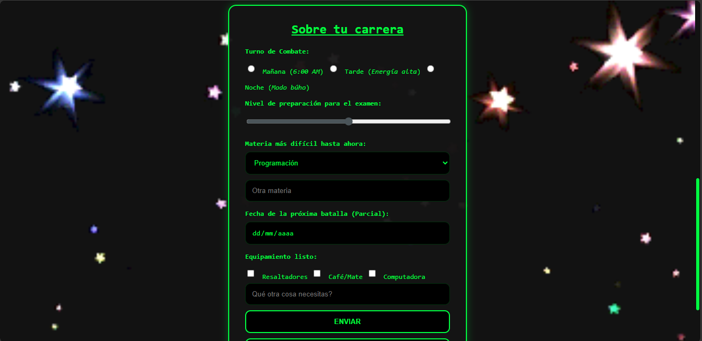

# Mi proyecto web
Proyecto: Guia de supervivencia a la universidad

# Descripción
Este sitio es una guía esencial para el día a día en la facultad. Acá encontrarás consejos prácticos para organizarte mejor y los métodos de estudio más efectivos para preparar tus exámenes. Es el manual que te acompaña en cada paso de tu carrera para que estudiar sea mucho más simple.

#  Contenido
Lo que vas a encontrar acá es lo siguiente:

-Los Villanos: Cómo identificar y vencer a los peores enemigos de la cursada.
-Entrenamiento: Los mejores métodos de estudio para que te rinda el tiempo.
-Tu Equipo: Lo que no te puede faltar en la mochila para sobrevivir al día.
-Consejos: Tips rápidos para no perder la paciencia ni el sueño.

# Autor
Abril Pérez Favit

# Aclaraciones
Diseñé esta web con estilo de película para que sea mucho más entretenida. Por eso vas a ver palabras y frases de cine, mi idea es que leer este manual no sea aburrido

# Mejoras visuales e interacticas
Para transformar la web y que quede adaptada al tema inical y adaptada a la temática de ciencia ficción/cyberpunk/modo pelicula, implemente una serie de optimizaciones en la hoja de estilo ('Style.css') y edite la estructura del HTML sin alteral la lógica inicial. 

# Cosas incorporadasa la web
1- Tipografía y Estética:
* Agregue fuentes de Google Fonts (como fue pedido) para dar el aspecto de una interfaz táctica. Usé (`Orbitron`) para los títulos principales para lograr ese estilo de cabecera de sistema o videojuegos y ocupé (`Rajdhani`) para los textos y párrafos para garantizar una lectura limpia.
* Tambien reemplacé los colores apagados por defecto por una paleta oscura q'se basa en un negro profundo (`#0b0c10`), grises limpios y contrastes vibrantes en verde neín ('#00ff41') con esto logre que las pantallas queden como comandos informáticos.

2- Rediseñe la tabla táctica (Escena 3):
* Para que quede una estructura limpie apliqué (`border-collapse: collapse;`) para poder eliminar las líneas dobles antiguas de HTML, para así tranformar el cuadro de técnicas de supervivencia en una matriz de datos moderna y minimalista.
* Por otro lado para que haya una interactividad dinámica programé un efecto de transición suave (`transition: background-color 0.3s ease;`) junto con pseudoselectores (':hover') . Para que ahora cuando pase el cursor sobre cualquier fila de la tabla, esta se ilumina sutilmente en verde neón, esto mejora la respuesta visual de la interfaz.

3- El menú de inventario de equipamiento (Escena 4):
* Para el efecto de ranura de contenedor diseñé la sección de "Armas principales" como si fuera un menú de equipamiento táctico. Cada ítem utiliza un fondo con degradado sutil (`linear-gradient`) y una barra lateral izquierda neón que reacciona con brillo y un sutil desplazamiento hacia arriba cuando el usuario de interactúa con ella.

4- Cierre del sistema y navegación eficiente:
* Para tener créditos prolijos modifiqué el pie de página ('footer') para centrar toda la información de autoría, aplicando estilos neón personalizados para destacar las etiquetas ('<strong>') y limpiar las cursivas comunes.
* En botones y flechas tácticas eliminé por completo los enlaces azules, subrayados clásicos. En su lugar, el botón "Volver al inicio" se transformó en un botón rectangular reactivo, y añadí flechas triangulares (`▲`)de retorno al final de cada escena para agilizar la navegación por el manual.

5- Media Queries:
* Modo tablet (max-width: 768px): El contenedor principal de 3 columnas ('.contenedor-principal') pasa a un flujo vertical fluido, reordenando las propagandas laterales arrriba y abajo del contenido para evitar que se pisen.
Modo celulares (max-width:480px): El menú de navegación se apila verticalmente como botones de pantalla completa. Asi mismo, las tarjetas de artículos ('.contenedor-bloque') activan 'flex-direction: column' ordenando las imágenes de forma centrada arriba y sus respectivos bloques de texto abajo, eliminando cualquier tipo de desborde horizontal.

# Capturas de pantallas de la web
Ingreso a la web:

Pantalla de la guía:

Formulario:

# Las tecnologías utilizadas:
Las tecnologías que ocupe para este proyecto integrador fueron HTML y CSS

# Ultimas actualizaciones del integrador 
En esta tercera etapa, el sitio dejó de ser estático y sumó interactividad pura mediante **JavaScript y  manipulación del DOM**, mejorando por completo la experiencia del usuario.

# Tecnologías Utilizadas
-HTML5
-CSS3
-JavaScript

# Funcionalidades Dinámicas Implementadas

# 1. Sistema de Acceso con Persistencia (Login)
* Al iniciar sesión, el sistema captura el nombre ingresado por el usuario mediante el evento `submit`. 
Usa `localStorage` para guardar el nombre, permitiendo que el manual le dé una bienvenida personalizada en la página principal como un "Agente" oficial.

# 2. Generador Aleatorio de Consejos (Manejo de Arrays)
* Creé un array con consejos de supervivencia reales.
A través del DOM, el script genera dinámicamente un botón de misión y un párrafo de texto. Al hacer `click`, calcula un índice aleatorio e inserta el consejo en pantalla.

# 3. Buscador Global en Tiempo Real
* Implementé un motor de búsqueda con el evento `keyup`. A medida que el usuario escribe, el script evalúa el texto y oculta o muestra los artículos y bloques del manual en vivo.

# 4. Filtro de Enemigos Académicos
* Para la sección de "Villanos", agregué botones de filtrado que escuchan el evento `click`. Usando estilos en línea, la página oculta o muestra las tarjetas según la categoría seleccionada (o muestra "todos").

# 5. Calculador del Estado Académico
* Una herramienta donde el estudiante ingresa las notas de sus parciales y su porcentaje de asistencia.
Al presionar el botón, el sistema procesa los datos y devuelve un cuadro de resultado dinámico con colores específicos: **Promocionado** (verde neón), **Regular** (amarillo) o **Recursando** (rojo).

# 6. Medidor de Preparación en Tiempo Real
* En la sección de contacto, incluí una barra de rango (`<input type="range">`). Con el evento `input`, el script detecta el movimiento en tiempo real y actualiza un mensaje motivador y su color según el nivel de estudio seleccionado.

# 7. Validación del Formulario de Contacto y Manejo de Errores
* Limpieza en vivo: El campo de celular rechaza automáticamente cualquier carácter que no sea un número.
* Estructura Try...Catch: Al intentar enviar el formulario, el sistema valida que los campos obligatorios no estén vacíos y que el mensaje tenga una longitud mínima. Si algo falla, lanza una excepción personalizada con un mensaje de alerta; si está todo bien, confirma el envío exitoso.

# Capturas de pantalla de la web actualizada

